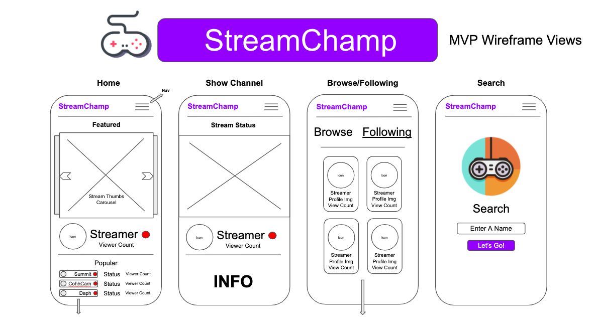
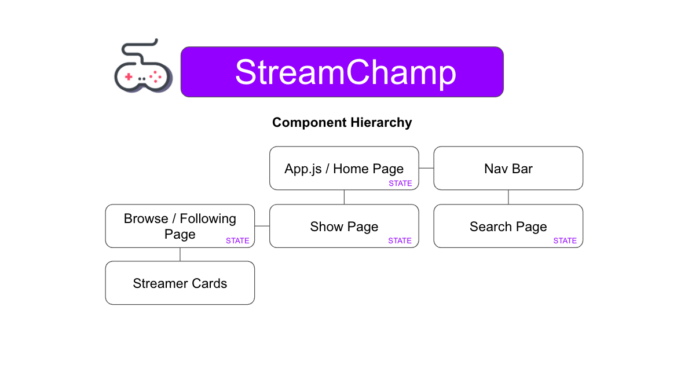
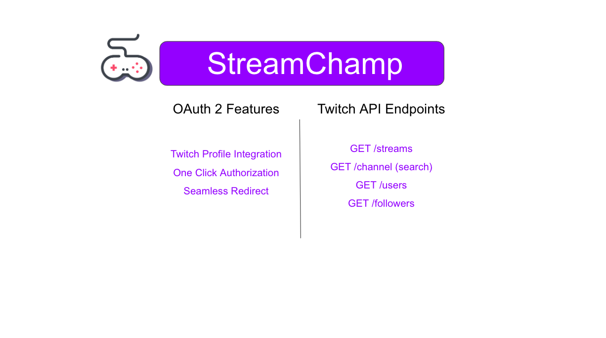
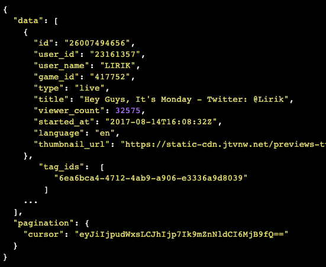

# Dylan Girard - StreamChamp

## Project Description

Welcome to StreamChamp - a visual re-imagining of the popular Twitch.tv streaming platform. This application allows viewing of many top Twitch streamers, with full chat, follow, and subscription integration. Using the custom Django API back-end, users can follow and view their favorite streamers and discover new streamers.

This application uses Twitch's API to collect user data, and is built using React/Bootstrap. It also uses TwitchEmbed, an NPM package that allows embedding of any Twitch channel based on user ID. The project has a high focus on visual design, responsiveness, and accessibility.

## Wire Frames

## Component Hierarchy

## Twitch API Data Example

## Back-End Architecture

## User Stories

**Minimum Viable Product Goals**

- As a user, I want to interact with a flashy, cool interface that fits into the Twitch aesthetic, because that's how I usually experience Twitch.
- As a user, I want to be able to view the most popular streams on Twitch because I love this platform.
- As a user, I want to be able to make an account to save info about myself, because I want Stream-Champ to know who I am when I come back.
- As a user, I want to be able to save my favorite streams so that I can find and watch them easily.

**Stretch Goals**

- As a user, I would like to be able to perform a search for streamers or games that I hear about, so that I can explore new Twitch experiences.
- As a user, I would like to be able to secure my information with password login, because I value my privacy.
- As a user, I would like to filter streamers with different viewership counts, because sometimes I like watching smaller streamers with less hectic chat rooms.
- As a user, I would like to have access to an about page with info featuring the creator of this app.
